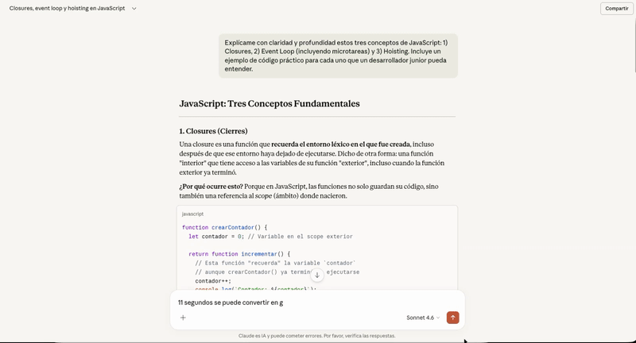
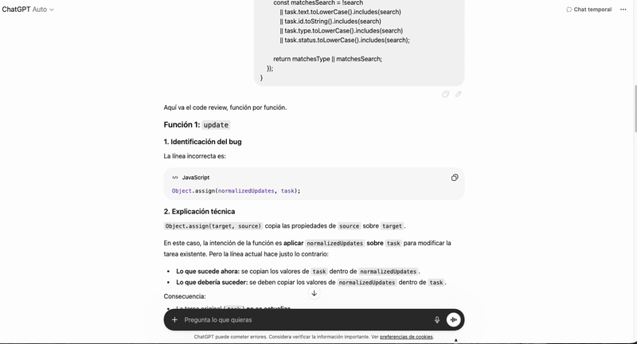
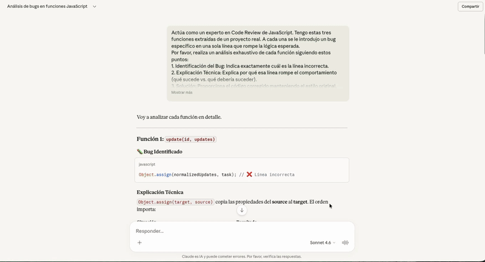
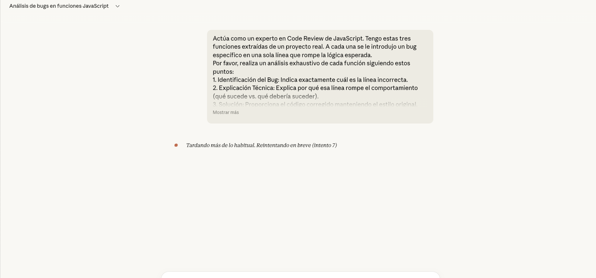

# AI Comparison

## Objetivo

Este documento recopila una comparacion entre distintos asistentes de inteligencia artificial aplicada a tareas tecnicas concretas. La idea no es decidir un ganador absoluto, sino observar diferencias en claridad, profundidad, estilo de explicacion, calidad del codigo y utilidad real dentro de un contexto de desarrollo.

## Primera parte: explicacion de conceptos tecnicos

Como primer ejercicio, se pidio a ambos modelos que explicaran tres conceptos tecnicos mediante un mismo prompt. La intencion fue comparar la manera en que cada asistente organiza su explicacion, el nivel de detalle que ofrece, la calidad de los ejemplos y la facilidad con la que una persona puede comprender la respuesta.

Para esta prueba se utilizo el mismo prompt en ambos modelos.

**Prompt utilizado**

```text
Explícame con claridad y profundidad estos tres conceptos de JavaScript: 1) Closures, 2) Event Loop (incluyendo microtareas) y 3) Hoisting. Incluye un ejemplo de código práctico para cada uno que un desarrollador junior pueda entender.
```

### Respuesta de ChatGPT


### Respuesta de Claude



### Analisis comparativo

De forma general, suele decirse que Claude tiende a ser mas academico, mas tecnico y mas cercano a un estilo cientifico, mientras que ChatGPT suele sentirse mas practico y mas creativo. Sin embargo, en esta prueba concreta el resultado fue un poco mas matizado.

En el caso de Claude, la explicacion se percibio como mas comoda de leer y menos sobrecargada. El tono fue claro y la presentacion del contenido estuvo bien organizada. Los ejemplos propuestos fueron funcionales y correctos, aunque en algunos puntos la explicacion profundizaba menos en detalles secundarios o en derivaciones del concepto.

En el caso de ChatGPT, la explicacion fue mas extensa y mas didactica. Se desarrollaron mas ideas alrededor de cada concepto y se cubrieron mas matices, lo que la hizo sentir mas completa desde un punto de vista pedagogico. El estilo del codigo generado fue funcional y legible, aunque menos elegante en presentacion que el de Claude.

Respecto al estilo del codigo, Claude entrego una respuesta que se sintio muy modular y bien presentada. ChatGPT, por su parte, entrego una solucion igualmente valida, clara y util, aunque con un enfoque algo menos directo. En rigor tecnico, ambos respondieron bien para conceptos de este nivel, y no se observaron errores graves en la explicacion base.

### Conclusion parcial

En esta primera comparacion, Claude destaco por una explicacion mas limpia y comoda de leer, mientras que ChatGPT destaco por ser mas didactico y mas amplio en el desarrollo de ideas. Para conceptos tecnicos simples, ambos modelos rindieron bien. La diferencia principal no estuvo tanto en la correccion, sino en el estilo de explicacion y en la cantidad de detalle ofrecido.

## Segunda parte: deteccion y correccion de bugs

Como segundo ejercicio, se utilizaron tres funciones reales del proyecto y se modifico una sola linea en cada una para introducir un error intencional. La idea de esta prueba es observar si cada asistente logra detectar el punto exacto donde se rompio la logica, explicar con claridad el bug y proponer una correccion sin alterar innecesariamente la arquitectura ni el estilo general del codigo.

Estas fueron las funciones utilizadas para la prueba:

```js
function update(id, updates) {
    const task = this._tasks.find(t => t.id === id);
    if (!task) return null;

    const normalizedUpdates = { ...updates };

    if (typeof normalizedUpdates.text === 'string') {
        normalizedUpdates.text = normalizedUpdates.text.trim();
    }

    if ('type' in normalizedUpdates) {
        normalizedUpdates.type = this._normalizeType(normalizedUpdates.type);
    }

    if ('status' in normalizedUpdates) {
        normalizedUpdates.status = this._normalizeStatus(normalizedUpdates.status);
    }

    Object.assign(normalizedUpdates, task);
    this._save();
    return task;
}
```

```js
function _extractQuotedValue(raw, flagName) {
    const quotedMatch = raw.match(new RegExp(`-(?:${flagName})\\s+["'](.+?)["']`, 'i'));
    if (quotedMatch) return quotedMatch[0];

    const singleWordMatch = raw.match(new RegExp(`-(?:${flagName})\\s+([^\\s]+)`, 'i'));
    return singleWordMatch ? singleWordMatch[1] : '';
}
```

```js
function _getFilteredTasks(tasks) {
    return tasks.filter(task => {
        const matchesType = this.filters.activeType === 'all' || task.type === this.filters.activeType;
        const search = this.filters.searchTerm;
        const matchesSearch = !search
            || task.text.toLowerCase().includes(search)
            || task.id.toString().includes(search)
            || task.type.toLowerCase().includes(search)
            || task.status.toLowerCase().includes(search);

        return matchesType || matchesSearch;
    });
}
```

Para esta prueba se utilizo el siguiente prompt en ambos asistentes:

```text
Tengo estas tres funciones extraidas de un proyecto real en JavaScript. A cada una se le modifico una sola linea y ahora tienen un bug.

Quiero que hagas lo siguiente para cada funcion:
1. Detectar cual es la linea sospechosa o incorrecta.
2. Explicar claramente cual es el bug y que comportamiento rompe.
3. Proponer la version corregida de la funcion.
4. No reescribas toda la arquitectura ni cambies el estilo general del codigo si no es necesario.

Aqui estan las funciones:

function update(id, updates) {
    const task = this._tasks.find(t => t.id === id);
    if (!task) return null;

    const normalizedUpdates = { ...updates };

    if (typeof normalizedUpdates.text === 'string') {
        normalizedUpdates.text = normalizedUpdates.text.trim();
    }

    if ('type' in normalizedUpdates) {
        normalizedUpdates.type = this._normalizeType(normalizedUpdates.type);
    }

    if ('status' in normalizedUpdates) {
        normalizedUpdates.status = this._normalizeStatus(normalizedUpdates.status);
    }

    Object.assign(normalizedUpdates, task);
    this._save();
    return task;
}

function _extractQuotedValue(raw, flagName) {
    const quotedMatch = raw.match(new RegExp(`-(?:${flagName})\\s+["'](.+?)["']`, 'i'));
    if (quotedMatch) return quotedMatch[0];

    const singleWordMatch = raw.match(new RegExp(`-(?:${flagName})\\s+([^\\s]+)`, 'i'));
    return singleWordMatch ? singleWordMatch[1] : '';
}

function _getFilteredTasks(tasks) {
    return tasks.filter(task => {
        const matchesType = this.filters.activeType === 'all' || task.type === this.filters.activeType;
        const search = this.filters.searchTerm;
        const matchesSearch = !search
            || task.text.toLowerCase().includes(search)
            || task.id.toString().includes(search)
            || task.type.toLowerCase().includes(search)
            || task.status.toLowerCase().includes(search);

        return matchesType || matchesSearch;
    });
}

Quiero una respuesta ordenada por funcion, explicando el error y mostrando la correccion final.
```

### Respuesta de ChatGPT



### Respuesta de Claude



### Evidencia de demora en Claude



### Analisis comparativo

En esta segunda parte la diferencia fue mucho mas marcada. Claude necesito mas de nueve intentos y mas de veinte minutos para entregar una solucion final al problema. La resolucion fue coherente, correcta y estuvo bien explicada, pero el proceso fue mucho mas lento de lo esperado para una tarea de este tamano.

Es importante aclarar que esta diferencia de tiempo no se observo una sola vez. El mismo ejercicio se repitio varias veces en Claude porque inicialmente se penso que podia tratarse de un error de conexion o de una respuesta incompleta. Sin embargo, al repetir la prueba dos y hasta tres veces, el comportamiento fue practicamente el mismo: la resolucion seguia tardando demasiado y requeria varios intentos para llegar a una respuesta final estable.

ChatGPT, en cambio, resolvio el mismo ejercicio de forma mucho mas rapida. La explicacion fue mas extensa y fue recorriendo el codigo paso por paso, lo cual la volvio un poco mas larga y en ciertos momentos algo mas tediosa de leer. Aun asi, ese detalle se puede corregir facilmente con prompting mas preciso, por ejemplo pidiendole que vaya mas directo al caso.

Claude respondio de una forma mas reducida y mas compacta, lo cual puede resultar agradable para algunas personas. Sin embargo, en esta prueba concreta esa ventaja de estilo no compenso la diferencia de tiempo ni de iteraciones necesarias para llegar al resultado correcto. Si se revisa la logica final de resolucion, ambos asistentes convergieron practicamente en los mismos errores y en las mismas correcciones.

Hay una idea que para mi es importante dejar por escrito: el codigo bonito no paga las cuentas. Lo que paga las cuentas es el codigo productivo, el codigo que permite avanzar con rapidez, detectar el problema y resolverlo sin perder tiempo innecesario. Clean Architecture, modularidad y buenas practicas siguen siendo importantes, pero dentro de un flujo real de desarrollo la productividad tambien pesa, y mucho.

### Conclusion parcial

En esta segunda comparacion la ventaja fue claramente para ChatGPT. Ambos modelos terminaron resolviendo bien el problema y la logica de correccion fue basicamente la misma, pero ChatGPT lo hizo en mucho menos tiempo y con mucha menos friccion. Claude mantuvo una respuesta coherente y tecnicamente valida, pero en este ejercicio concreto la diferencia de productividad fue demasiado grande como para ignorarla.
