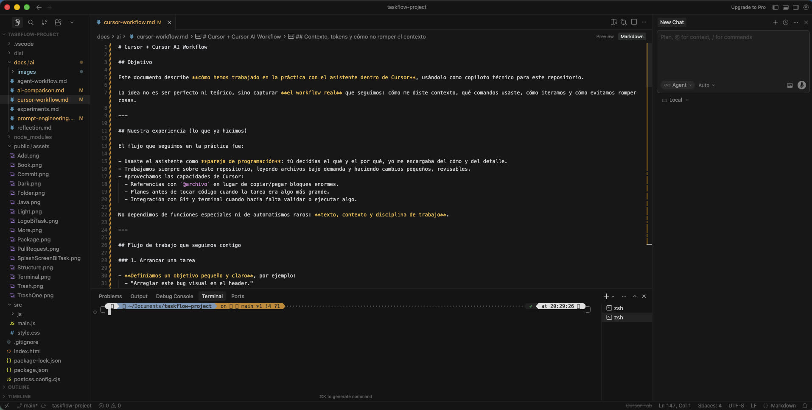
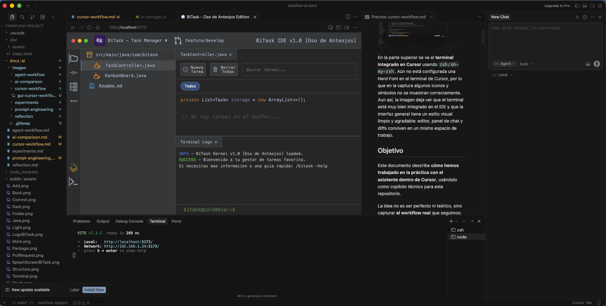
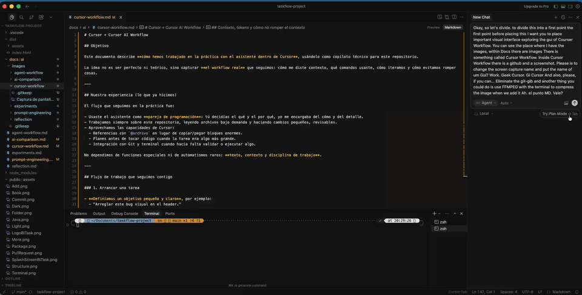

# Cursor + Cursor AI Workflow

## Interfaz visual (GUI) de Cursor Workflow

En la parte superior se ve el **terminal integrado en Cursor** usando `zsh`/`oh-my-zsh`. Aún no está configurada una Nerd Font en el terminal de Cursor, por lo que en la captura algunos iconos y símbolos no se muestran correctamente. Aun así, la imagen deja ver que el terminal está muy bien integrado en el IDE y que la interfaz general tiene un estilo visual limpio y agradable: editor, panel de chat y diffs conviven en un mismo espacio de trabajo.

## Navegador integrado para el dev server

Cuando lanzamos el proyecto con `npm run dev` (o cualquier comando que levante un servidor local tipo `http://localhost:3000`), Cursor detecta automáticamente la URL y permite **abrirla en una pestaña integrada dentro del propio IDE**, en lugar de abrirla en Google Chrome u otro navegador externo.

En la siguiente captura se ve ese modo:

Lo interesante es que **parece “otra pestaña más del editor”**: comparte la misma barra de pestañas, tema y entorno visual de Cursor. De esta forma puedes:

- Ver la app corriendo en el navegador integrado.
- Hacer cambios en el código justo al lado.
- Alternar entre editor, terminal y vista del navegador sin salir del IDE.

En mi experiencia, este flujo hace que trabajar con el dev server sea mucho más cómodo y “fluido”, porque no tengo que ir saltando constantemente entre Cursor y una ventana aparte del navegador.

Además del navegador integrado, también quise documentar otra capacidad interesante de Cursor: **ejecutar comandos directamente desde el terminal con ayuda del asistente**, sin que yo tuviera que ir escribiéndolos manualmente uno a uno. En este caso, le pedí que comprimiera un vídeo con `ffmpeg` y Cursor resolvió el flujo en terminal, convirtiendo el archivo original de `.mov` a `.mp4`.

Ese ejemplo no es una demo de `npm run dev` ni del arranque del servidor local, sino una muestra de cómo Cursor puede ayudarme con tareas operativas reales dentro del proyecto desde el propio terminal. Dejo aquí el resultado en GIF para que se vea el flujo dentro del documento:

Este GIF (`cursor-terminal-autonomous-commands.gif`) se generó a partir de la grabación original para reutilizarlo más fácilmente en documentación o presentaciones.

## Objetivo

Este documento describe **cómo he trabajado en la práctica con el asistente dentro de Cursor**, usándolo como copiloto técnico para este repositorio.

La idea no es ser perfecto ni teórico, sino capturar **mi workflow real**: cómo le di contexto, qué comandos utilicé, cómo iteré y cómo evité romper cosas.

---

## Mi experiencia real

El flujo que seguí en la práctica fue:

- Utilicé el asistente como **pareja de programación**: yo decidía el qué y el por qué, y Cursor me ayudaba con el cómo y con el detalle.
- Trabajé siempre sobre este repositorio, leyendo archivos bajo demanda y haciendo cambios pequeños, revisables.
- Aproveché varias capacidades de Cursor:
  - Referencias con `@archivo` en lugar de copiar/pegar bloques enormes.
  - Comando de voz para dictar instrucciones de forma rápida.
  - Integración con Git y terminal cuando hacía falta validar o ejecutar algo.

No dependí de funciones especiales ni de automatismos raros: **texto, contexto y disciplina de trabajo**.

---

## Flujo de trabajo que seguí

### 1. Arrancar una tarea

- **Definía un objetivo pequeño y claro**, por ejemplo:
  - "Arreglar este bug visual en el header."
  - "Refactorizar este hook para simplificarlo."
  - "Escribir la documentación básica de esta feature."
- **Daba el contexto mínimo necesario**, usando referencias de Cursor:
  - `Revisa @src/components/Header.tsx y dime qué ves raro en la estructura.`
  - `El bug está descrito en @docs/bugs/header-bug.md.`

### 2. Iterar con cambios pequeños y revisables

- Cursor proponía cambios **acotados** (idealmente en uno o pocos archivos).
- Yo revisaba:
  - El código (diff).
  - El comportamiento (UI, tests, logs).
- Si algo no encajaba, pedía ajustes:
  - `Deshaz solo el cambio en X.`
  - `Deja esta parte como estaba y simplifica el resto.`

### 3. Confirmar y hacer commit

Cuando algo quedaba estable:

- Validaba que:
  - Compila / pasan los tests relevantes.
  - El código se entiende.
- Después, hacía commit con un mensaje claro.  
Varias veces le pedí ayuda a Cursor para redactar un buen mensaje a partir del diff.

---

## Comandos y atajos que utilicé en Cursor

No es una lista exhaustiva de todos los atajos de Cursor, solo los que más influyeron en cómo trabajé con él.

- **Referencia de archivos con `@`**  
  - En el chat, escribir `@` y seleccionar un archivo/carpeta.  
  - Esto es mejor que copiar/pegar todo el archivo, porque:
    - Evita ruido.
    - Me deja leer solo lo que necesito con las herramientas internas.

- **Comando de voz**  
  - Fue una de las funciones que más utilicé en la práctica.
  - Me servía para dictar instrucciones, describir cambios o explicar rápido lo que quería hacer sin perder tiempo redactando prompts largos.
  - En mi workflow real, esto hacía que la interacción con Cursor fuera más natural y más ágil.

- **Uso de historiales y diffs**  
  - Revisar el diff que Cursor muestra después de cambios sugeridos.
  - Si algo no me gustaba, se lo decía directamente:
    - `Ese cambio en la función X no me convence, propón una alternativa más simple.`

---

## Contexto y uso real

En la práctica, gran parte del valor de Cursor no estuvo en “meter muchísimos tokens”, sino en que lo utilicé para **explicar bien lo que quería hacer**. Más que volcar información masiva de golpe, el flujo consistía en dar contexto útil, señalar los archivos relevantes y dejar claro el objetivo.

Lo que mejor funcionó fue:

- Explicar con mis palabras qué quería conseguir o qué problema estaba viendo.
- Referenciar archivos concretos con `@` en lugar de copiar bloques enormes.
- Añadir solo el contexto necesario en cada momento: error, objetivo, restricción o expectativa.

Ese estilo de trabajo hacía que Cursor entendiera mejor la tarea sin saturar la conversación y, sobre todo, convertía la interacción en algo mucho más natural: menos “prompt engineering” forzado y más explicación directa de lo que necesitaba.

Como consecuencia, este documento de **Cursor Workflow** fue realizado casi en su totalidad con ayuda de Cursor. A partir de mis explicaciones, del contexto que ya veníamos arrastrando y de comandos o detalles que podían estar presentes en memoria dentro de la conversación, Cursor pudo reconstruir bastante bien lo que habíamos hecho y ayudarme a dejarlo documentado con bastante fidelidad.

---

## Experimento final: documentar `UIManager` con Cursor (JS Talk)

Como pequeño experimento práctico, utilicé este mismo workflow para documentar el archivo `src/js/ui-manager.js`. La idea era ver **cómo se comporta Cursor cuando le pides que “ponga en palabras” una pieza de JS real** que ya existe en el proyecto.

### Qué le pedí a Cursor

- Que leyera `src/js/ui-manager.js` y me hiciera un **“JS Talk”**: una explicación en lenguaje natural de qué hace cada bloque importante de `UIManager`.
- Que añadiera **JSDoc con `@param` y `@returns`** en las funciones clave, pero sin escribir comentarios obvios ni ruidosos.

### Qué decidió documentar y por qué

Cursor se centró en:

- **Funciones que forman parte del API “público” del objeto**:
  - `setSearchTerm(searchTerm)` y `setActiveType(type)`: son las que gobiernan el estado de filtros. Documentarlas con `@param {string}` deja claro qué esperan y cómo afectan al filtrado.
  - `renderTypeFilters(tasks)` y `renderTaskList(tasks)`: son las encargadas de pintar la UI; tienen un contrato claro (“me das tareas y yo las renderizo”) que merece ser explícito.
- **Funciones internas con lógica no trivial**:
  - `_getFilteredTasks(tasks)`: aunque es privada, concentra la lógica de filtrado combinado (tipo + texto). Por eso lleva `@param`, `@returns` y `@private`, para dejar claro que no se llama desde fuera pero sí es importante entenderla.
  - `_escapeHTML(str)`: es pequeña, pero crítica en términos de seguridad (evitar inyecciones al usar `innerHTML`), así que se documentó su intención más que su implementación.
- **Funciones que conectan con la metáfora de IDE/terminal**:
  - `printTerminalLine(input, response)`: plasma visualmente la idea de “comando + respuesta” que aparece en este documento (terminal integrada, comandos autónomos). Aquí interesaba dejar claro qué es `input` y qué es `response`.

En cambio, **no se añadieron JSDoc detallados** a métodos cuyo comportamiento ya es muy evidente por el propio nombre y el HTML implicado (`toggleTerminal`, `toggleGeneric`, `switchTab`, `setActiveFileLink`), para evitar comentarios redundantes. Esa decisión forma parte del estilo que he seguido en todo el documento: **explicar lo que aporta contexto o intención**, no repetir lo que ya es obvio en el código.

Este experimento resume bastante bien cómo veo el rol de Cursor: no solo genera o modifica código, sino que puede ayudar a **explicar y documentar decisiones** (qué es público, qué es interno, qué es crítico para la UX o la seguridad) siguiendo las pistas que ya hay en el propio proyecto.
