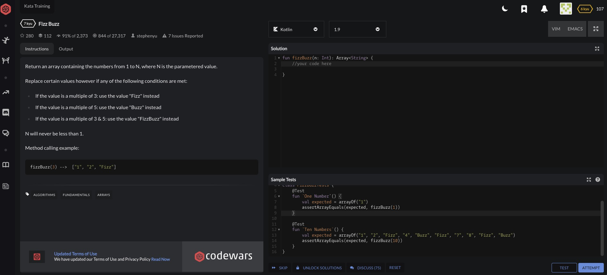
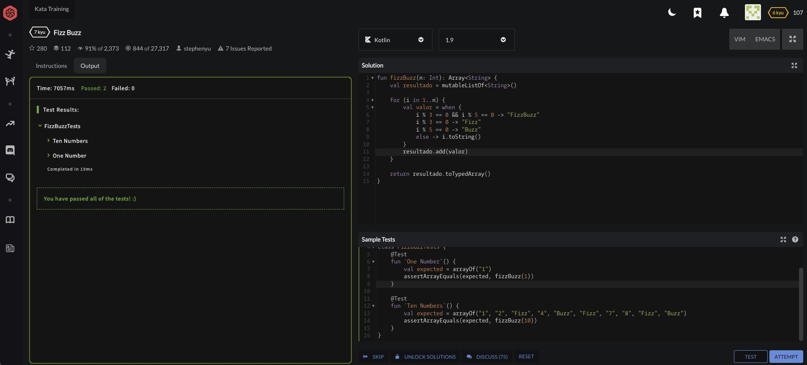
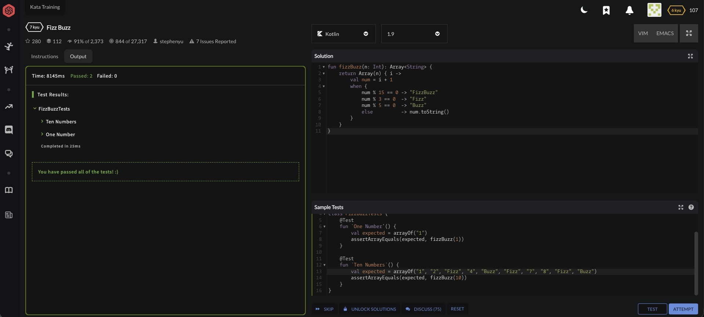
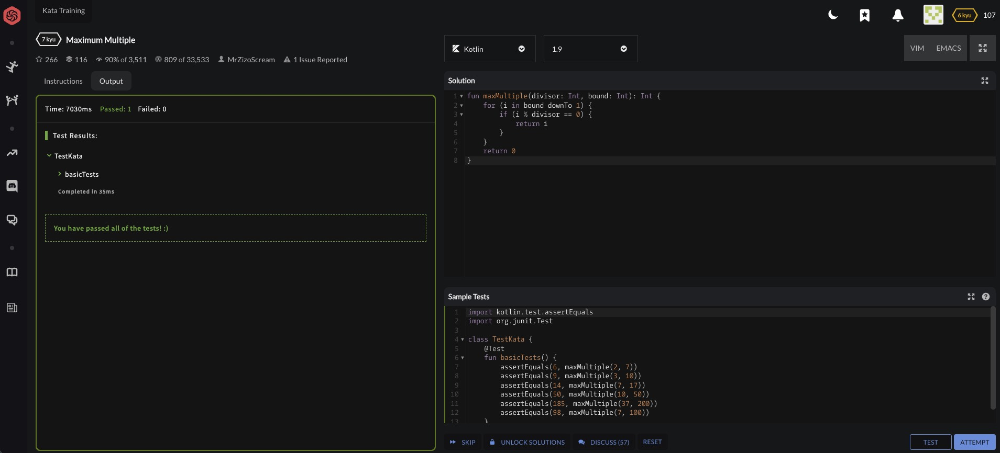
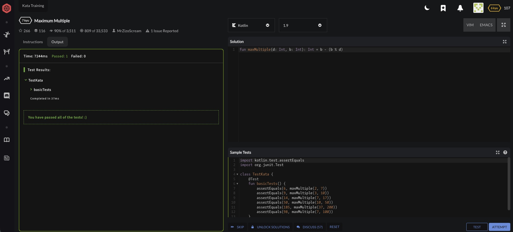

# Experiments

## Objetivo

Este documento resume algunos experimentos realizados con apoyo de IA durante el desarrollo del proyecto.

## Experimento 1: Migracion progresiva a Tailwind

- **Hipotesis:** Migrar de forma incremental reduciria el riesgo de romper toda la interfaz.

- **Resultado:** Funciono mejor que una migracion completa de golpe. Permitio revisar cada modulo visual antes de continuar.

## Experimento 2: Activar preflight despues de la migracion base

- **Hipotesis:** Activar `preflight` al final seria mas seguro que activarlo desde el principio.

- **Resultado:** La hipotesis fue correcta. Primero se estabilizo la migracion visual y luego se activo `preflight`, corrigiendo solo lo necesario.

## Experimento 3: Mover keyframes manuales a Tailwind config

- **Hipotesis:** Centralizar animaciones en `tailwind.config.cjs` dejaria el proyecto mas limpio.

- **Resultado:** La animacion `slideDown` se pudo migrar correctamente y el CSS base quedo mas ordenado.

## Experimento 4: Tokens semanticos de color

- **Hipotesis:** Renombrar colores de marca a tokens semanticos facilitaria el mantenimiento del tema.

- **Resultado:** Se logro mejorar la legibilidad del sistema de estilos sin cambiar el aspecto visual base del proyecto.

## Experimento 5: Persistencia local con serializacion JSON

- **Hipotesis:** Para guardar tareas en persistencia local, era mejor serializar una estructura clara de datos a JSON que usar estructuras de control menos estables o mas acopladas al render.

- **Resultado:** Se utilizo un array de tareas en memoria y luego `JSON.stringify(...)` para persistirlo en `localStorage`. Esto recordo el flujo de serializacion usado en controladores REST y resulto mas claro, mas mantenible y mas seguro para el guardado de informacion que improvisar una estructura menos consistente.

## Experimento 6: Hotfix aislado por rama

- **Hipotesis:** Separar un problema de light mode en una rama hotfix haria mas seguro el arreglo.

- **Resultado:** Permitio corregir el bug del color del texto fuerte sin mezclarlo con trabajo de documentacion o desarrollo general.

## Experimento 7: Cambio grande sobre modelo, terminal y UI

- **Hipotesis:** Se quiso medir que tan consistente podia ser la inteligencia artificial realizando un cambio grande dentro del proyecto en un solo proceso, concretamente al añadir `status` y `type` a las tareas.

- **Resultado:** El experimento fue un exito. El cambio se aplico de forma consistente en el modelo de datos, la persistencia, la terminal, la GUI, el render y la documentacion. No es posible asegurar con certeza si el buen resultado se debio principalmente a la modularidad del proyecto, a la separacion de carpetas, a la claridad del flujo o a que el codigo no estaba excesivamente revuelto. Probablemente fue una combinacion de todos esos factores. En cualquier caso, el resultado final fue muy consistente y demostro que un cambio relativamente grande podia integrarse sin romper la coherencia general del sistema.

## Experimento 8: Resolver pequenos problemas primero sin IA y luego con IA

Como extension practica del trabajo en `docs/ai`, se planteo este ejercicio:

- Elegir pequenos problemas de programacion.
- Resolverlos primero sin usar IA.
- Resolverlos despues con ayuda de IA.
- Comparar tiempo invertido, calidad del codigo y comprension del problema.
- Repetir mas adelante el experimento con tareas relacionadas con el propio proyecto.

En esta primera tanda quedaron documentados dos ejercicios pequenos externos al proyecto, ambos resueltos en Codewars usando Kotlin.

### Ejercicio 1: FizzBuzz

#### Enunciado inicial

La tarea consistia en devolver un array desde `1` hasta `N`, reemplazando:

- multiplos de `3` por `"Fizz"`,
- multiplos de `5` por `"Buzz"`,
- multiplos de `3` y `5` por `"FizzBuzz"`.

#### Captura del problema sin resolver



#### Solucion hecha sin IA



La solucion propia fue completamente valida y paso todos los tests. El enfoque fue imperativo y bastante claro:

- se creo una lista mutable,
- se recorrio el rango `1..n`,
- se resolvio cada caso con un `when`,
- y al final se devolvio el resultado como array.

**Estimacion de tiempo sin IA:** alrededor de 15 a 20 minutos.  
**Comprension del problema:** alta. El problema era sencillo y quedaba claro por que la solucion funcionaba.  
**Calidad del codigo:** buena en legibilidad, aunque algo mas verbosa de lo estrictamente necesario.

#### Solucion con IA



La version con IA tambien paso todos los tests, pero uso una construccion mas compacta apoyada en `Array(n)` y una transformacion directa del indice.

**Estimacion de tiempo con IA:** alrededor de 2 a 4 minutos entre pedirla, revisarla y entenderla.  
**Comprension del problema:** media-alta. La logica seguia siendo clara, pero habia que detenerse un poco mas a leer el enfoque funcional y la transformacion del indice.  
**Calidad del codigo:** muy buena en concision. Aun asi, la solucion propia resulta mas didactica para alguien que este empezando.

#### Comparacion breve

- Sin IA hubo mas tiempo invertido, pero tambien una comprension mas organica del flujo.
- Con IA se llego antes a una solucion correcta y mas compacta.
- En este caso, la IA gano en velocidad, mientras que la solucion manual gano ligeramente en valor pedagogico.

### Ejercicio 2: Maximum Multiple

#### Solucion hecha sin IA



En este ejercicio se debia encontrar el mayor multiplo de `divisor` que no superara `bound`.

La solucion manual se resolvio recorriendo desde `bound` hacia abajo hasta encontrar el primer valor divisible. Es una estrategia muy clara y robusta:

- se entiende rapido,
- no requiere trucos matematicos,
- y refleja bien la logica del enunciado.

**Estimacion de tiempo sin IA:** alrededor de 8 a 12 minutos.  
**Comprension del problema:** alta. El razonamiento era directo y facil de verificar mentalmente.  
**Calidad del codigo:** buena, aunque menos elegante que una solucion matematica cerrada.

#### Solucion con IA



La solucion generada con IA fue mucho mas corta:

```kotlin
fun maxMultiple(d: Int, b: Int): Int = b - (b % d)
```

**Estimacion de tiempo con IA:** 1 a 3 minutos.  
**Comprension del problema:** media. La expresion es correcta y elegante, pero requiere entender por que `b - (b % d)` produce exactamente el multiplo maximo permitido.  
**Calidad del codigo:** muy alta en concision y eficiencia. Sin embargo, como material de aprendizaje inicial, la version manual puede ser mas intuitiva.

#### Comparacion breve

- La version propia explica mejor el razonamiento paso a paso.
- La version con IA llega a una formula mejor y mas elegante.
- En este caso, la IA no solo fue mas rapida, sino que ademas produjo una solucion matematicamente mas fina que la primera aproximacion manual.

### Relacion con los experimentos realizados dentro del proyecto

Respecto a tareas mas cercanas al trabajo real del proyecto, el experimento mas importante fue la gran refactorizacion realizada posteriormente y reflejada en el commit grande de arquitectura.

En esa fase se utilizo IA para empujar cambios estructurales mucho mas complejos que los ejercicios pequenos de Codewars. Entre otras cosas, se hizo lo siguiente:

- dividir el proyecto por `features`,
- separar mejor handlers, vista y logica de negocio,
- mover la logica principal de tareas a una zona de dominio,
- reorganizar terminal, toolbar, task panel, calendar filter, task list y kanban board,
- centralizar el acceso a `localStorage` y dejar claras las `storage keys`,
- y anadir nuevas vistas, controles, botones y comportamientos dentro de la UI.

Desde el punto de vista conceptual, esta parte funciono como una comparacion practica entre enfoques cercanos a `MVC` y `MVVM`. No se aplico un patron academico puro al cien por cien, pero si se uso la IA para llevar el proyecto hacia una organizacion mas modular, mas legible y mas mantenible.

Uno de los cambios mas utiles fue justamente el de persistencia: en vez de dejar llamadas al storage regadas por muchas funciones, se paso a explicitar mejor que se estaba guardando, donde se guardaba y que parte del sistema era responsable de ello.

En resumen, si los ejercicios pequenos sirvieron para comparar velocidad, estilo y comprension en problemas aislados, la refactorizacion del proyecto sirvio para medir algo mas exigente: que tan consistente podia ser la IA al ayudar en una reorganizacion real del codigo sin romper la aplicacion.

## Conclusión

Los experimentos mas exitosos fueron los que se hicieron en pasos pequeños, con validacion inmediata y con posibilidad de rollback rapido.

Tambien conviene dejar una idea clara al cerrar este documento: la productividad puede ser el factor mas influyente cuando se quiere cambiar features, lanzar hotfixes o empujar pruebas de estres posteriores sin frenar el proyecto durante dias.

En este trabajo se vio varias veces que, con apoyo de IA, algunos cambios que habrian tomado muchisimo mas tiempo pudieron salir muy rapido. Eso incluyo:

- Refactors grandes de arquitectura,
- Hotfixes sobre UI y tema,
- Nuevas vistas,
- Reorganizacion de storage,
- Añadido de botones, handlers y features completas.

Es verdad que no siempre se uso un enfoque academico puro. A veces la arquitectura fue una mezcla rara entre `MVC` y `MVVM`, y a veces lo importante no era perseguir la perfeccion teorica sino llegar a una solucion que funcionara, que se pudiera mantener y que permitiera seguir avanzando.

En ese sentido, importa recordar algo muy simple: el codigo bonito y perfectamente estructurado no paga por si solo las cuentas. El codigo productivo, el que permite construir, probar, corregir y lanzar rapido, suele tener un valor practico mayor cuando el objetivo es mover el proyecto hacia delante.

Este tipo de idea no es exclusiva de este repositorio. Un caso muy citado es el de Pieter Levels con productos como `InteriorAI` y `PhotoAI`, donde el discurso publico ha sido precisamente priorizar velocidad de construccion, iteracion y lanzamiento sobre una obsesion temprana con la arquitectura perfecta. En una publicacion sobre `InteriorAI`, Levels explico que lo construyo en cinco dias con HTML, CSS y JavaScript vanilla en una sola pagina, mas PHP en servidor, y aun asi el producto logro traccion real. La leccion no es "da igual la calidad", sino que la productividad y la capacidad de iterar tambien forman parte de la calidad cuando se construye un producto.

Por eso, una de las conclusiones mas honestas de este experimento es esta: la IA no solo sirvio para resolver ejercicios pequeños, sino para acelerar de forma brutal cambios grandes dentro del proyecto. Y si el resultado fue un commit enorme, extraño y probablemente un poco sospechoso, tambien fue porque permitio empujar mucho trabajo real en muy poco tiempo. Y, honestamente, estuvo de puta madre.
